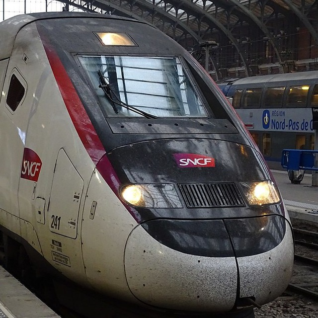

<p align="center">
  
</p>

# MaxPing

[](https://t.me/maxping_bot)
[](https://t.me/maxping_updates)
[](https://github.com/leonekmi/MaxPing/commits/main)
[](https://github.com/leonekmi/MaxPing/blob/main/LICENSE)

> MaxPing trouve les trains maxables avant qu'ils disparaissent !

MaxPing est un robot Telegram qui trace les trains avec des sièges disponibles dans le cadre de l'abonnement MAX Jeune / Senior de la SNCF.

Pour parvenir à ça, le robot contacte l'API Max Planner toutes les 15 minutes pour vérifier la disponibilité des trains enregistrés par les utilisateurs du bot.

## Problèmes avec l'application

En cas de problème avec le robot MaxPing, n'hésitez pas à ouvrir un ticket

## Envrionnement de développement

Toutes les contributions sont acceptées ! Merci simplement de respecter les règles établies par la configuration ESLint (installer l'extension du même nom sur votre IDE devrait suffir) et d'utiliser Prettier (là aussi fourni par une extension de votre IDE du même nom). Également, merci de respecter la bienséance dans les discussions autour de l'application.

```sh
# -- avant tout :
# * Vérifiez que vous respectez les exigences logicielles pour Prisma : https://www.prisma.io/docs/reference/system-requirements
# * Créez un bucket Influx en installant le votre ou en utilisant un hébergé (https://www.influxdata.com/)
# * Créez un robot avec @Botfather (il faut activer le mode inline)
# --

# Insallation rapide de l'environnement de développement
git clone https://github.com/leonekmi/MaxPing.git
cd MaxPing
yarn

# Spécification des variables d'envrionnement
cp .env.example .env
$EDITOR .env

# au choix
yarn build # construire l'application
# - ou -
yarn watch # reconstruire l'application à chaque modification

# Démarrer le robot
yarn start
```

_Source de l'icône : Ad Meskens - Own work, CC BY-SA 4.0, https://commons.wikimedia.org/w/index.php?curid=77507366_
